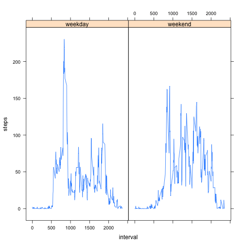

# Reproducible Research: Peer Assessment 1


## Loading and preprocessing the data


```r
activity <- read.csv("activity.csv", colClasses = c("integer", "Date", "integer"))
```


## What is mean total number of steps taken per day?


```r
steps <- activity$steps
hist(steps)
```

 

```r
mean(steps, na.rm = TRUE)
```

```
## [1] 37.38
```

```r
median(steps, na.rm = TRUE)
```

```
## [1] 0
```


## What is the average daily activity pattern?


```r
average.steps <- aggregate(steps ~ interval, activity, mean)
plot(average.steps, type = "l")
```

 

```r
max(average.steps$steps)
```

```
## [1] 206.2
```


## Imputing missing values


```r
sum(is.na(activity$steps))
```

```
## [1] 2304
```

Let's replace NAs with the mean for the corresponding 5-minute interval.


```r
for (i in average.steps$interval) {
    activity$steps[activity$interval == i & is.na(activity$steps)] <-
        average.steps$steps[average.steps$interval == i]
}
steps <- activity$steps
hist(steps)
```

 

```r
mean(steps, na.rm = TRUE)
```

```
## [1] 37.38
```

```r
median(steps, na.rm = TRUE)
```

```
## [1] 0
```

The mean and the median are the same.

## Are there differences in activity patterns between weekdays and weekends?


```r
activity$wday <- "weekday"
activity$wday[weekdays(activity$date) %in% c("Saturday", "Sunday")] <- "weekend"
average.steps <- aggregate(steps ~ wday + interval, activity, mean)
library(lattice)
xyplot(steps ~ interval | wday, data = average.steps, type = "l")
```

 
